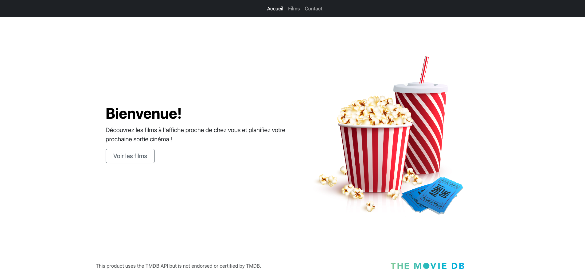
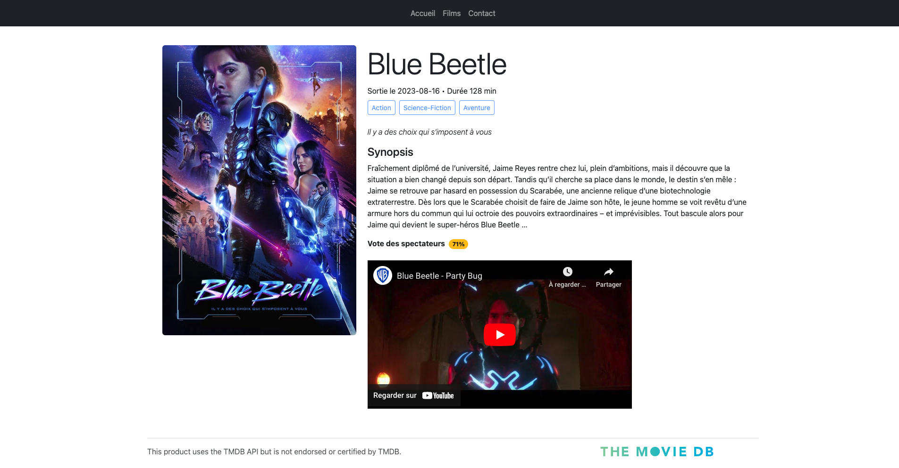

# SPA NodeJS ApiRest TMDB

<!-- TABLE OF CONTENTS -->
<details>
  <summary>🏁 Sommaire</summary>
  <ol>
    <li><a href="#-intro">Intro</a></li>
    <li><a href="#-quickstart">Quickstart</a></li>
    <li><a href="#-features">Features</a></li>
    <li><a href="#-built-with">Built with</a></li>
    <li><a href="#-screenshots">Screenshots</a></li>
  </ol>
</details>

## ⚡ Intro

Exploitation des données de l'API de The Movie Data Base à partir d'une Single Page Application et à l'aide d'un serveur Node JS.
Les données recherchées sont celles des films présentement à l'affiche dans les cinémas canadiens.

Les librairies utilisées : express, dotenv et node-fetch.

Lien vers le projet : https://cinema.johannapenet.com

Documentation de l'[API TMDB](https://developer.themoviedb.org/reference/intro/getting-started).

## 🚀 Quickstart

Installez les dépendances définies dans `package.json` à la racine du projet et démarrer le serveur :
```bash
npm install
npm start
```

## 🎯 Features

- Affichage de la liste des films étant présentement à l'affiche des cinémas canadiens (limitée à la première page des résultats). Cette liste est présentée sous la forme d'une grille des différents posters des films.
- Affichage d'une page détaillant les informations du film sélectionné.
- Affichage de la bande-annonce embeddée dans un player youtube.
- Navigation du site dans le menu ou dans les différentes pages des films sans recharger le navigateur.

## 🤖 Built With

     

## 🌐 Screenshots




